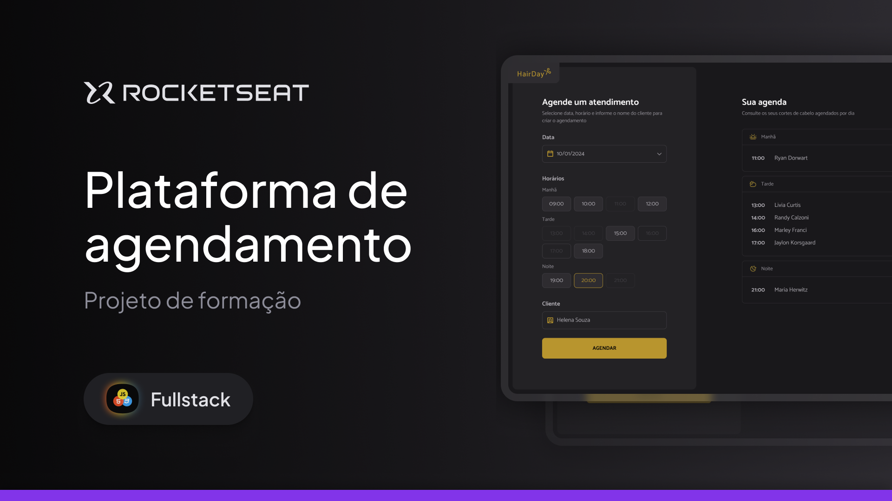

<h1 align="center">
  
</h1>



## Projeto 💻

Hair Day é uma aplicação web de agendamentos de cortes de cabelo

Esse é um dos desafios da formação Full Stack, um dos conteúdos disponíveis para alunos da Rocketseat.

## Tecnologias

Esse projeto foi desenvolvido com as seguintes tecnologias

- HTML
- CSS
- JavaScript
- Webpack
- Babel
- JSON Server

---

## Acessar o Projeto

Para acessar o projeto, basta seguir esse passo a passo:

1 - Clone o repositório

```
git clone https://github.com/pduartesilva2005/hairday.git
```

2 - Instale as dependências

```
npm install
```

3 - Rode a build, em seguida o api e a aplicação web

```
npm run build
npm run server
npm run dev
```

Criado por Pedro Duarte
